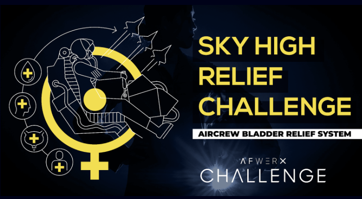

# Sky High Relief

This GitHub repository focuses on developing advanced bladder relief systems for female aircrew. Our aim is to provide safe, comfortable, and effective hydration and relief solutions for extended flights.

## Project Overview

SkyHighRelief is part of the AFWERX Challenge, enhancing operational capabilities and health safety for female aircrew by improving current bladder relief systems. We invite contributions from innovators and researchers to address this issue. For more details on our project and to ask any questions, visit our [Sky High Relief Ask Me Anything (AMA)](https://afwerxchallenge.com/air/sky-high-relief-ask-me-anything-ama) page.

## Events

### AFWERX Challenge Innovation Unleashed Virtual Event
- **Date & Time**: April 17, 2024, 11:00 AM PT / 2:00 PM ET
- **Description**: A virtual event highlighting the Sky High Relief Challenge, detailing the AFWERX Challenge process and outcomes of cross-sector collaboration. Hear from the USAF Aircrew Performance sponsor team and solution providers, including Airion Health, about their challenge experiences and successes.
- **Registration**: Open to U.S. and allied country innovators. Please share this invite to enhance impact and collaboration. [Register here](https://www.zoomgov.com/webinar/register/WN_N2JW9xFtR2icKuTRiQ4FIw?tk=9zOkSdBj7w6oUr63PKCo-hiBcDps21iRXvFlrPbHB3k.AG.JyaZjK53CbbuoGzXmRkhW1hlGUtQQ1qIRImZcLyQOiFpqAltaNTPgIJwJbyUi4CNNjQoQNwZ0pHIROONRcjFsbumx-uGdUvSXULcE0rKKmwM0Q.jp6l4KkaVcGTwLJC8HEROQ._AjvF_Cdp4uexrlX#)

## Scientifically Grounded Solutions

### 1. Advanced Wearable Catheter Systems
- **Science**: Uses biocompatible materials that adapt to body heat and movement, with a valve that activates during urination. Silver nanoparticle coatings offer antimicrobial properties, reducing infection risks.

### 2. Absorbent, Form-Fitting Undergarments
- **Science**: Features superabsorbent polymers (SAP) for significant liquid absorption, combined with a breathable, leak-proof polyurethane laminate (PUL) layer for comfort and skin health.

### 3. Compact Fluid Disposal Units
- **Science**: Utilizes osmotic gradients and a hydrogel matrix for fluid absorption, plus a compact electrolysis unit that separates waste into hydrogen and oxygen for easy flight management.

### 4. Smart Hydration Management Systems
- **Science**: Incorporates biosensors to monitor physiological indicators like electrolyte levels and hydration, using algorithms to suggest fluid intake based on environmental and health data.

### 5. Privacy-Enhanced Onboard Facilities
- **Science**: Features touchless technology and photocatalytic titanium dioxide coatings to maintain cleanliness and reduce microbial contamination through light-activated degradation.

### 6. Biodegradable, Disposable Solutions
- **Science**: Made from polylactic acid (PLA), these solutions are designed to degrade under specific conditions post-flight, offering an environmentally friendly disposal option.

### 7. Integration with Health Monitoring Systems
- **Science**: Employs non-invasive near-infrared (NIR) spectroscopy for continuous urinary metabolite monitoring, providing real-time kidney function and hydration level data.

## Contributing

We encourage diverse field participation to foster innovation in developing practical, scientifically sound solutions. Refer to our issues tab to engage with current challenges or propose new ideas.

## License

Licensed under the MIT License. For details, see the `LICENSE` file in this repository.

These approaches meet aviation demands, merging science with practical applications for innovation and effectiveness.
